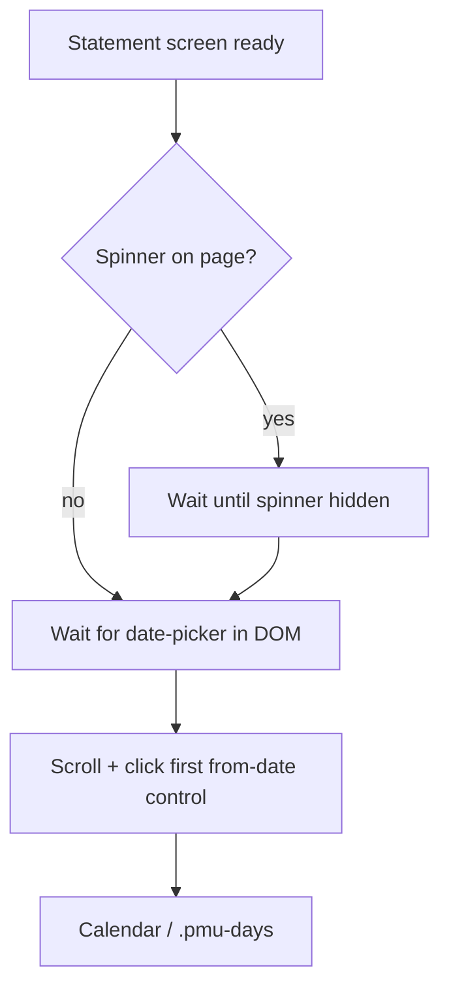

# Changelog

All notable changes to this fork (`@hirez10/israeli-bank-scrapers`) are documented here. Release versions and Git tags are produced by [semantic-release](https://github.com/semantic-release/semantic-release) (`hirez-v*` tags).

## Maintenance — npm dependency refresh (May 2026)

### English

- Ran `npm update` within existing semver ranges and committed the updated `package-lock.json` (no vulnerabilities reported by `npm audit` at refresh time).
- Raised declared minimum versions in `package.json` where the lockfile resolved newer patch/minor releases: `puppeteer` ^24.43.0, `prettier` ^3.8.3, `@types/node` ^25.6.1, `typescript-eslint` ^8.59.2.
- **Deferred** (separate migration PR): ESLint 10, Jest 30, TypeScript 6, major bumps for `cross-env`, `husky`, `fs-extra`, `moment-timezone`.
- **Toolchain:** `@typescript-eslint` 8.59.x surfaced new `no-unnecessary-type-assertion` findings; removed redundant assertions (and an unused import in `visa-cal.ts`).

### עברית

- עדכון `npm` בתחום ה-semver הקיים ועדכון `package-lock.json`.
- שדרוגי major לא בוצעו במסגרת זו.

## Yahav — from-date picker selector (May 2026)

### English

**Symptom:** Sync failed after successful login with:

`Waiting for selector div.date-options-cell:nth-child(7) > date-picker:nth-child(1) > div:nth-child(1) > span:nth-child(2) failed`

**Cause:** The scraper used a fixed positional selector, `div.date-options-cell:nth-child(7)`, to open the “from” date control on the account statement screen. Bank Yahav changed the layout (number/order of cells in that row), so the seventh column no longer contained the `date-picker`.

**Fix:** Locate the first `div.date-options-cell` that contains a `date-picker`, then click the same inner `span` as before (`:scope > div:nth-child(1) > span:nth-child(2)`). This avoids depending on a brittle column index.

**Code:** `src/scrapers/yahav.ts` — function `openYahavFromDatePicker`.

### עברית

**תסמין:** אחרי התחברות תקינה, הסנכרון נכשל עם שגיאת `waitForSelector` על בורר התאריך.

**סיבה:** הקוד הסתמך על העמודה השביעית בשורת האפשרויות (`nth-child(7)`). שינוי בממשק האתר שינה את מספר או סדר התאים, והבורר כבר לא היה באותו אינדקס.

**תיקון:** לחיצה על בורר התאריך הראשון שנמצא בתוך תא `.date-options-cell` שמכיל `date-picker`, בלי לנחש מספר עמודה קבוע.

## Yahav — `date-picker` wait / visibility (May 2026)

### English

**Symptom:** After release `hirez-v1.0.11`, some runs failed with:

`Waiting for selector div.date-options-cell date-picker failed`

(often with `visible: true` implied by the scraper helper).

**Cause:** The bank UI can attach `date-picker` to the DOM before Puppeteer considers it **visible** (layout, animation, overflow, or parent visibility). Waiting only for a **visible** compound selector times out even though the control is present.

**Fix:**

1. Wait for **DOM presence** via `page.waitForFunction` — any `date-picker` under `div.date-options-cell` or `.statement-options`.
2. **Scroll into view** and click the inner `span` (with fallbacks), or click the host `date-picker` if needed.
3. After the statement header is ready, wait for **`.loading-bar-spinner`** to disappear when present so the date row is stable.

**Resilience flow (high level):**

### עברית

**תסמין:** כשל `waitForSelector` על `div.date-options-cell date-picker`.

**סיבה:** האלמנט יכול להיות ב-DOM אך עדיין לא מסומן כ-visible עבור Puppeteer, ולכן המתנה ל-selector "גלוי" נכשלת.

**תיקון:** המתנה לנוכחות ב-DOM, גלילה לתצוגה, לחיצה עם מספר ניסיונות ל-span פנימי, והמתנה לסיום ספינר טעינה לפני בורר התאריך.

## Yahav — loading spinner wait (May 2026)

### English

**Symptom:** Some runs failed with a generic Puppeteer timeout, e.g. `Waiting failed: 30000ms exceeded`, during `fetch_transactions`, even after the date-picker visibility fix.

**Cause:** `waitUntilElementDisappear('.loading-bar-spinner')` was called unconditionally. In Puppeteer, waiting for an element to become **hidden** when it **never exists** in the DOM can consume the full default timeout (~30s).

**Fix:** Only call `waitUntilElementDisappear` for `.loading-bar-spinner` when the element is present (`waitYahavLoadingSpinnerGoneIfPresent`). Use the same helper after navigation, before/after date search, and on the statement screen.

### עברית

**תסמין:** timeout כללי של ~30 שניות בשלב איסוף תנועות.

**סיבה:** המתנה להיעלמות ספינר שלא הופיע בכלל ב-DOM.

**תיקון:** המתנה להיעלמות הספינר רק אם הוא קיים.
